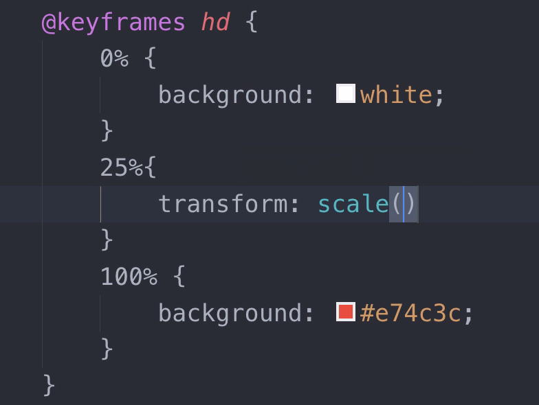

<!--
 * @Descripttion: 
 * @version: 
 * @Author: wy
 * @Date: 2021年01月19日 22:16:07
 * @LastEditors: wy
 * @LastEditTime: 2021年01月20日 15:55:21
-->

# transition属性

> 关于过渡：有中间值的属性才有过渡效果

- transition-property:生效的过渡属性
- transition-duration:过渡持续时间(与property匹配，不够则循环匹配)
- transition-timing-function:过渡变化效 果（linear，easy-in等。。）
  - transition-timing-function:steps(4,start)或者steps(4,end)
- transition-delay:延迟时间 (也可以与property匹配，不够则循环匹配)
- 有一个监听过渡结束的API接口事件**transitionend**
- transition:all 过渡变化效果 过渡时间(必须) 延迟时间

# animation关键帧

> 关于animation：有中间值的属性才有动画效果

- animation-name:关键帧名称（可设置多个名称）
- animation-duration:动画持续时间（可设置多个时间与上面对应，不够则循环匹配）
- animation-iteration-count:动画循环次数（可设置与上面对应，不够则循环匹配）
- animation-direction:动画方向（normal，reverse，alternate，alternate-reverse）
- animation-delay:延迟时间（可设置多个时间与上面对应，不够则循环匹配）
- animation-timing-function:steps(4,start)或者steps(4,end)
- animation-play-state:控制动画暂停与播放（paused，running）
- animation-fill-mode:填充模式（初始状态，起始帧，末尾帧）
- animation:名称 填充模式 持续时间 延迟时间
  - 如 animation:test both 2s 3s;
