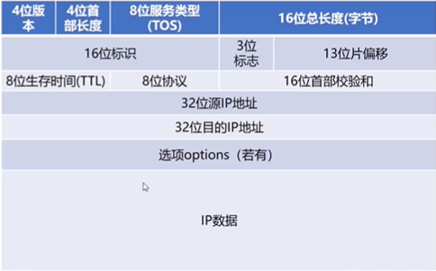
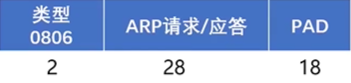
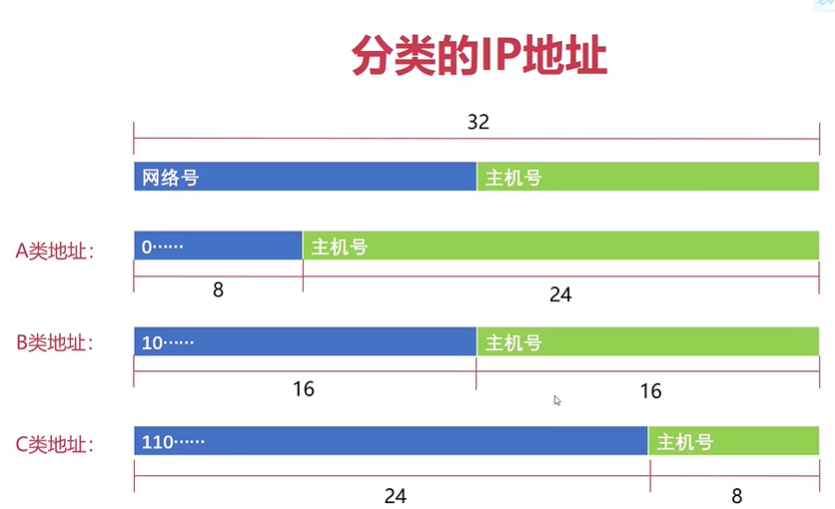
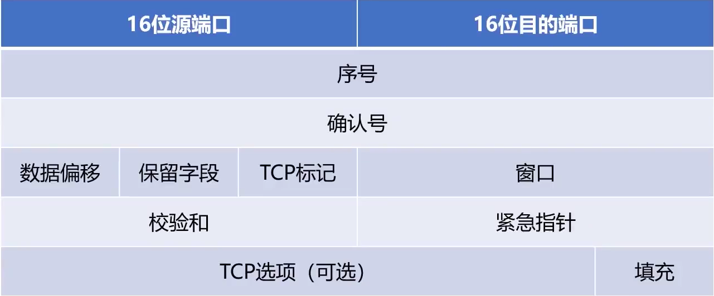
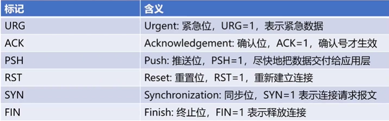
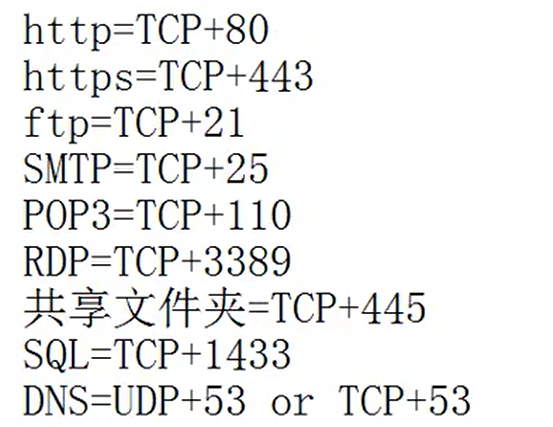

<!--
 * @Descripttion: 
 * @version: 
 * @Author: wy
 * @Date: 2021年01月31日 11:30:52
 * @LastEditors: wy
 * @LastEditTime: 2021年02月03日 21:52:32
-->
# 概述-物理层-数据链路层
- 计算机网络分类：广域网，城域网，局域网
- 使用者分类：公用网络，专用网络
- OSI七层模型：，传输层，网络层，数据链路层，物理层
- TCP/IP四层模型：应用层（应用层，表示层，会话层），传输层，网际层，网络接口层（数据链路层，物理层）
- 现代互联网的网络拓扑：
  - 边缘部分：终端，路由器，网关，地区ISP
  - 核心部分：地区ISP，主干ISP,国际路由器..
  
- 计算机网络性能指标：
  - bps=bit/s
  - 时延：发送时延，传播时延，处理时延，排队时延。
    - 
    - 
    - 处理时延：被处理所需要的时间
    - 排队时延：数据包在网络中等待被处理的时间
    - 总时延：四个相加
  - 往返时间RTT：数据报文在端到端通信中来回一次需要的时间
- 物理层：双绞线（有无屏蔽），同轴电缆，光纤
  - 分用复用技术：频分，时分，波分，码分
- 数据链路层：封装成帧，透明传输，差错检测
  - 封装成帧：首部和尾部是特定的控制字符（SOH和EOT）
  - 透明传输：控制字符当做不存在去处理（EOT字符前面加ESC转义）
  - 差错检测：奇偶校验码，循环冗余校验码。
    - 奇偶校验码：偶数为0，奇数为1
    - 循环冗余校验码：
      - CRC的错误检测能力与位串的阶数r有关
      - 数据链路层只进行数据的检测，不进行纠正
  - MTU：最大传输单元MTU(Maximum Transmission Unit)，一般1500
  - 路径MTU：路径MTU由链路中MTU的最小值决定
  - 以太网协议
# 网络层
- 解决的一大问题：决定数据在网络中的路径
- IP地址：最多x32个
- IP协议：长度20个字节
  
  - TTL：生存时间，防止找不到终点的时候，占用带宽
  - 16位标识：协议：ICMP,IGMP,IP,TCP,UDP,OSPF
- IP地址转发流程
  - 路由器上有路由表
  - 加源IP地址，目标IP地址（包），决定起点终点（IP地址不变）
  - 数据链路层：加入源MAC地址，目标MAC地址，帧检验序列FCS （帧），决定下一跳给谁（MAC地址是在变的）
- ARP协议：地址解析协议

  
    - IP地址转成MAC地址（ARP缓存表）
    - ARP缓存表上没有IP地址和MAC地址映射关系,ARP会将IP地址广播，目标MAC地址都是FF--FF-FF-FF-FF-FF
  - RARP协议： 逆地址解析协议
- 子网划分

  - 子网掩码：子网划分用。也可以判断网络号，主机号
- ICMP协议：为了更有效的转发IP数据报和提高交付成功的机会
  - 不是高层协议，是IP层协议
- RIP协议：路由信息协议，动态路由协议，周期性广播
- OSPF协议：动态路由协议，内部网关协议，最短路径优先协议（根据带宽算）
- BGP协议：外部网关协议
- 关于网络层：IP (RIP OSPF BGP) ICMP IGMP ARP
# 传输层
- TCP协议：
  
  - 面向连接，数据分段，可靠的，编号，流量控制，点到点，全双工的通信，面向字节流的协议。
  - TCP标记：
  
  - 为什么可靠？
    - 停止等待协议：发送消息后，进行等待，收到确认消息后才会发送第二个消息（无差错的情况），超时重传（有错的情况），对信道的利用率不高
    - 连续ARQ协议：提高信道利用率的协议，会有滑动窗口的概念，有选择重传（SACK标志位）的概念
  - 流量控制
    - 控制窗口大小，指明允许对方发送的数据量（标志位rwnd）
    - 窗口为0的时候，启动坚持定时器，定时发送窗口探测报文
- 拥塞控制
  - 1.慢启动算法：由小到大逐渐增加发送数据量，每收到一个报文确认，就加一（指数增长，会有阈值）
  - 2.拥塞避免算法：维护一个拥塞窗口的变量,只要网络不拥塞，就试探着拥塞窗口调大（线性增长）

- UDP协议：
  - 无连接，一个数据包完成通信，面向报文传输的，不可靠，不建立连接，没有拥塞控制。
  - qq聊天是UDP协议；
- 传输层和应用层之间的关系
  

